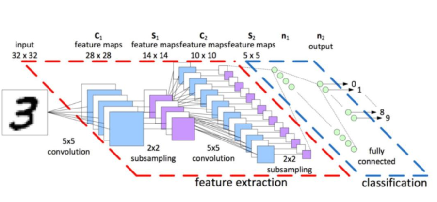

# Handwritten numeral recognition model


## Install package

- pip install keras==2.2.4
- pip install tensorflow==1.13.1


## 手写体数字MNIST数据集介绍
- MNIST 数据集介绍
    - http://yann.lecun.com/exdb/mnist/
    - 由纽约大学的 Yann LeCun 等人维护
    
- 获取 MNIST 数据集

- MNIST 手写体数字介绍
    - ［28， 28］ 的二阶数组来表示每个手写体数字
    -  MNIST 数据集中的图像都是256阶灰度图， 即灰度值 0 表示白色（背景） ， 255 表示黑色（前景）
    -  做数据规范化， 将灰度值缩放为［0， 1］ 的float32数据类型
    - 下载和读取 MNIST 数据集
        - from tensorflow.examples.tutorials.mnist import input_data
        - mnist = input_data.read_data_sets("/tmp/data/", one_hot=True)
    - tf.contrib.learn 模块已被废弃
    
- 使用 Keras 加载 MNIST 数据集
    - tf.kera.datasets.mnist.load_data(path=‘mnist.npz’)
    
- MNIST 数据集 样例可视化

- Code
    - 使用 tf.contrib.learn 模块加载 MNIST 数据集（Deprecated）:
        - [IntroduceMNIST](./IntroduceMNIST.py)
        
    - 使用 Keras 加载 MNIST 数据集
        - [IntroduceMNISTKeras](./IntroduceMNISTKeras.py)


## MNIST Softmax 网络介绍
- 感知机模型
    - 神经感知机模型 Perceptron
    
- 神经网络
    - 神经网络是多层神经元的连接
    
- 线性不可分

- 激活函数（Activation Function）

- 全连接层（fully connected layers， FC）

- 前向传播
    - 符号定义
    - 计算过程
    
- 后向传播（ Back Propagation, BP）
    - BP算法的基本思想是通过损失函数对模型参数进行求导
    
- MNIST Softmax 网络


## 实战 MNIST Softmax 网络
- MNIST Softmax 网络层模型
- 加载MNIST数据集
- 数据处理：规范化
- 统计训练数据中各标签数量

- 数据处理：One-hot编码
    - 几种编码方式的对比
    
        | Binary | Gray code | One-hot  |
        | ------ | --------- | -------- |
        | 000    | 000       | 00000001 |
        | 001    | 001       | 00000010 |
        | 010    | 011       | 00000100 |
        | 011    | 010       | 00001000 |
        | 100    | 110       | 00010000 |
        | 101    | 111       | 00100000 |
        | 110    | 101       | 01000000 |
        | 111    | 100       | 10000000 |
        
    - one-hot应用（Word to vector）
      
      
    
    
- 使用Keras sequential model定义神经网络
    - softmax 网络层模型    
    


- 编译模型
[model.compile()](https://keras.io/models/sequential/#compile)

```python
compile(optimizer, loss=None, metrics=None, loss_weights=None, sample_weight_mode=None, weighted_metrics=None, target_tensors=None)
```

- 训练模型，并将指标保存到history中
[model.fit()](https://keras.io/models/sequential/#fit)

```python
fit(x=None, y=None, batch_size=None, epochs=1, verbose=1, callbacks=None, validation_split=0.0, validation_data=None, shuffle=True, class_weight=None, sample_weight=None, initial_epoch=0, steps_per_epoch=None, validation_steps=None)
```

- 可视化指标
- 保存模型
[model.save()](https://keras.io/getting-started/faq/#how-can-i-save-a-keras-model)

You can use `model.save(filepath)` to save a Keras model into a single **HDF5 file** which will contain:

- the architecture of the model, allowing to re-create the model
- the weights of the model
- the training configuration (loss, optimizer)
- the state of the optimizer, allowing to resume training exactly where you left off.

You can then use `keras.models.load_model(filepath)` to reinstantiate your model. load_model will also take care of compiling the model using the saved training configuration (unless the model was never compiled in the first place).

- 加载模型
- 统计模型在测试集上的分类结果

- Code
    - [MNISTSoftmax](./MNISTSoftmax.py)


## MNIST CNN 网络介绍
- CNN 简介
    - 卷积神经网络（ConvoluTIonal Neural Networks， 简称CNN）
     
- 卷积（Convolution）
    - 卷积是分析数学中的一种基础运算， 其中对输入数据做运算时所用到的函数称为卷积核。
    
- 卷积层（Convolutional Layer, conv）
    - 卷积层是使用一系列卷积核与多通道输入数据做卷积的线性计算层
    
- 池化层（Pooling）
    - 池化层是用于缩小数据规模的一种非线性计算层
    
- Dropout 层
    - Dropout 是常用的一种正则化方法， Dropout层是一种正则化层
    
- Flatten
    - 将卷积和池化后提取的特征摊平后输入全连接网络， 这里与 MNIST softmax 网络的输入层类似
    
- MNIST CNN 示意图


	
	
## 实战 MNIST CNN 网络
- 加载 MNIST 数据集
- 数据处理：规范化
- 统计训练数据中各标签数量
- 数据处理：one-hot 编码
- 使用 Keras sequential model 定义 MNIST CNN 网络
- 查看 MNIST CNN 模型网络结构
- 编译模型
- 训练模型，并将指标保存到 history 中
- 可视化指标
- 保存模型
- 加载模型
- 统计模型在测试集上的分类结果
- Code
    - [MNISTCNN](./MNISTCNN.py)


