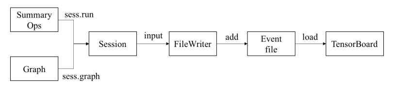
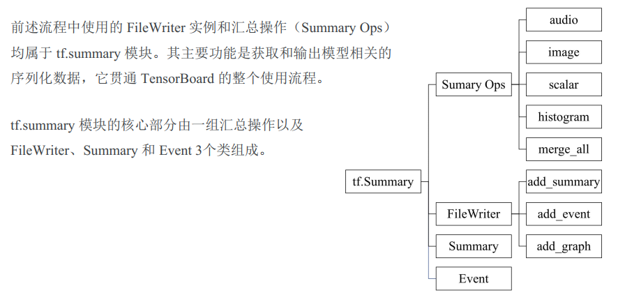
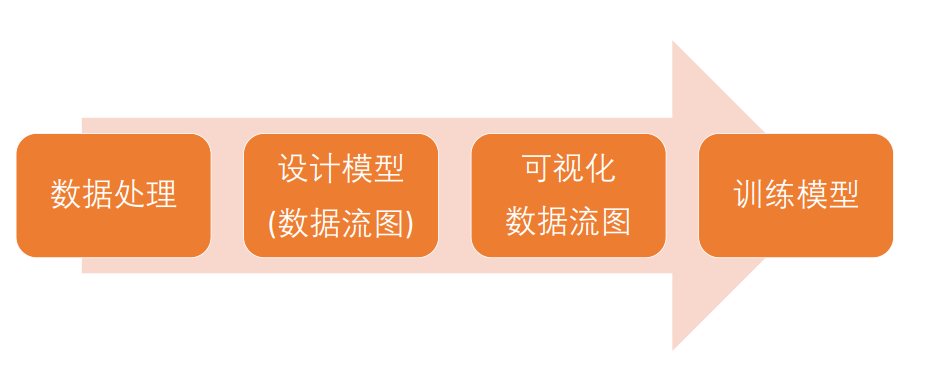

# Housing Price Forecasting Model

## 房价预测模型介绍

- 监督学习（Supervised Learning）
    - 监督学习是机器学习的一种方法， 指从训练数据（输入和预期输出） 中学到一个模型（函数） ，并根据模型可以推断新实例的方法
    - 函数的输出通常为一个连续值（回归分析） 或类别标签（分类）
- 监督学习算法
    - 线性回归
    - 逻辑回归
    - 决策树
    - ...
- 线性回归算法
    - 在统计学中， 线性回归是利用称为线性回归方程的最小二乘函数对一个或多个自变量和因变量之间关系进行建模的一种回归分析。 
- 单变量线性回归
    - 最小二乘法
        - y=b + wx
        - 优化目标为最小化残差平方和
    - 乘以二分之一，消除求导的系数
    - 梯度下降
        - 求导
- 多变量线性回归
    - 梯度下降
- 单变量房价预测问题
- 多变量房价预测问题
    - 数据分析
    - 特征归一化
		
		
## tensorflow实现房价预测模型

- tensorflow训练模型的工作流
    - 数据读入
    - 数据分析
    - 数据规范化
    - 创建模型（数据流图）
    - 创建会话（运行环境）
    - 训练模型

- Tools
    - 数据分析库：Pandas
        - 数据结构化和数据分析工具
        - 数据框（Data Frame）
        - 数据读入
            - pandas.read_csv()
    - 数据可视化库：matplotlib & seaborn & mplot3d
        - matplotlib 是一个 Python 2D 绘图库
        - seaborn 是一个基于 matplotlib的 Python 数据可视化库
        - mpl_toolkits.mplot3d 是一个基础 3D绘图（散点图、 平面图、 折线图等） 工具集
    - 数据分析2D
        - seaborn.lmplot 方法专门用于线性关系的可视化， 适用于回归模型
    - 数据分析3D
        - Axes3D.scatter3D 方法专门用于绘制3维的散点图
    - 数据归一化3D
        - 使用归一化公式实现
    - 数据处理库：NumPy
        - NumPy 是一个 BSD 开源协议许可的， 面向 Python 用户的基础科学计算库， 在多维数组上实现了线性代数、 傅立叶变换和其他丰富的函数运算
        
- Code
    - 单变量房价预测
        - [SingleDataReadAndShow](./SingleDataReadAndShow.py)
    - 多变量房价预测
        - [MultiDataReadAndShow](./MultiDataReadAndShow.py)
    - 数据归一化
        - [MultiDataNormalize](./MultiDataNormalize.py)
    - 数据处理，添加ones列
        - [MultiDataAddOnesColumn](./MultiDataAddOnesColumn.py)
    - 数据获取，获取数据x, y
        - [MultiDataGetXY](./MultiDataGetXY.py)
    - 创建线性回归模型（数据流图）
        - [CreateLineRegressionModel](./CreateLineRegressionModel.py)
    - 创建会话（运行环境）
        - [CreateSessionRun](./CreateSessionRun.py)

## tensorboard可视化模型数据流图

- TensorBoard可视化工具
- TensorBoard可视化训练
- TensorBoard可视化统计数据
- TensorBoard可视化数据分布
- TensorBoard可视化数据
- TensorBoard可视化数据流图
- TensorBoard使用流程
    - 用户使用FileWriter实例将数据写入时间文件，启动TensorBoard程序，
    加载事件文件中的序列化数据，从而可以子啊各个面板中展示对应的可视化对象

- tf.summary模块介绍
    - Summary Ops
    - FileWriter
    - Summary
    - Event

- 可视化数据流图工作流
    - 创建数据流图
        - which one is better?
        - 名字作域与抽象节点
            - tf.name_scope
    - 创建FileWriter
    - 启动TendorBoard
        - tensorboard --logdir ./ --host localhost

- Code
    - 可视化数据流图
        - [TensorBoardVisualizeGraph](./TensorBoardVisualizeGraph.py)
    - 可视化损失值
        - [MultiDataShowLoss](./MultiDataShowLoss.py)    

## 实战tensorflow房价预测

- 实战tensorflow房价预测工作流

- Code
    - 实战房价预测
        - [DataProcess](./JupyterCode/DataProcess.ipynb)
        - [TrainingModel](./JupyterCode/TrainingModel.ipynb)
        - [VisualizeGraph](./JupyterCode/VisualizeGraph.ipynb)
        - [VisualizeLoss](./JupyterCode/VisualizeLoss.ipynb)

