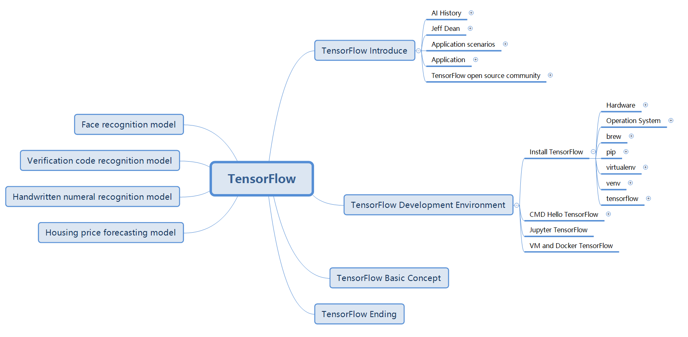

# TensorFlow
This is a TensorFlow study guide, I hope to help you!

# Start

- clone project

    
    git clone https://github.com/Kate-liu/TensorFlow.git

- TensorFlow Introduce

    [TensorFlowIntroduce](./TensorFlowIntroduce/README.md)

- TensorFlow Development Environment

    [TensorFlowDevelopmentEnvironment](./TensorFlowDevelopmentEnvironment/README.md)
    
    
- TensorFlow Basic Concept

    

- TensorFlow Ending

    

- Other guides (wait sometimes......)

# Tutorials

- [tensorflow](https://github.com/tensorflow/tensorflow)

- [TensorFlow.org](https://www.tensorflow.org/)

- [TensorFlow Tutorials](https://www.tensorflow.org/tutorials/)

