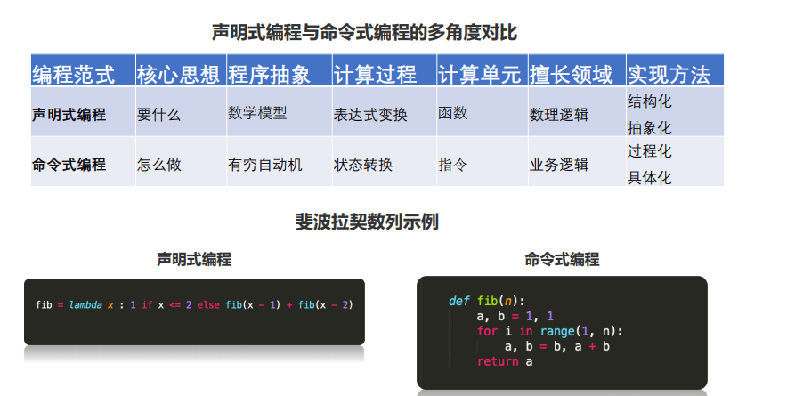
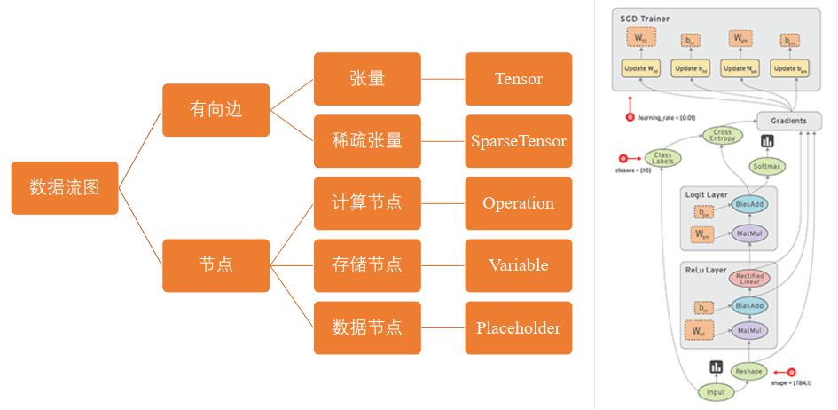
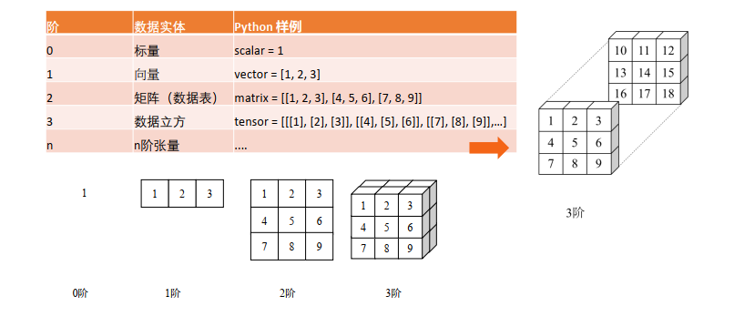
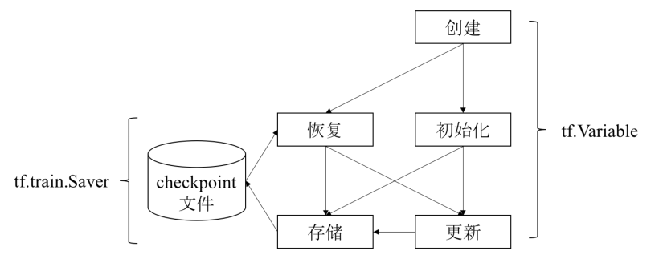
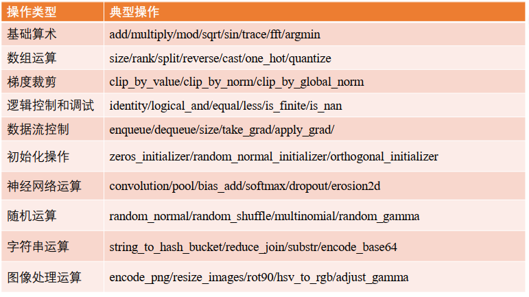
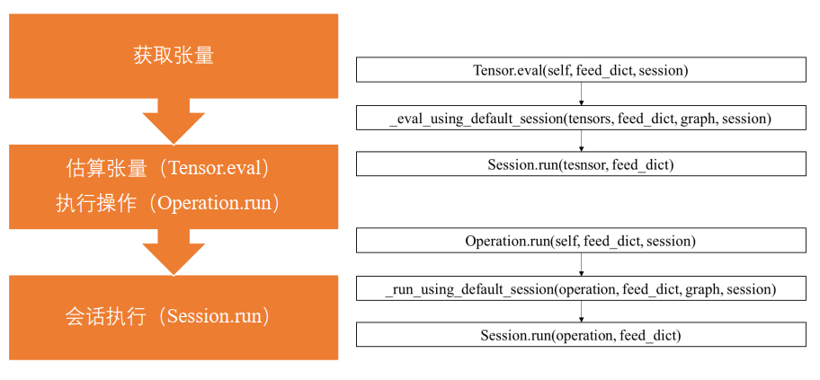
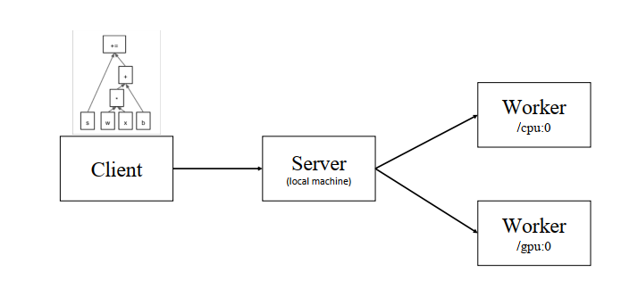
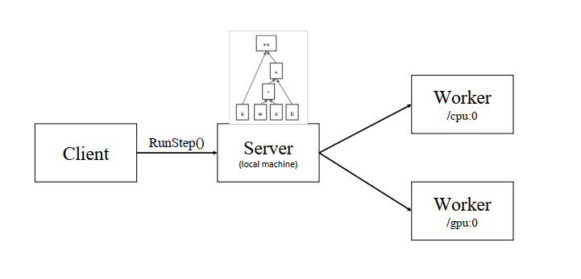

# TensorFlow Basic Concept

## Install package

- pip install tensorflow==1.14.0


## TensorFlow modules and APIs
- High-level
    - Estimators
    - keras
- Mid-level
    - Layers
    - Datasets
    - Metrics
- Low-level
    - Python
    - c++
    - java
    - go
- kernel
    - Tensorflow Distributeed Execution Engine


## TensorFlow Architecture

- API
- Distribute
- Common
- kernel function
- XLA
- Net
- hardware


## TensorFlow Data flow diagram
- 声明式编程
    - 核心思想是要什么
    - 程序抽象为数学模型
    - ...
    
- 命令式编程
    - 核心思想是怎么做
    - 程序抽象为有穷自动机
    - ...


    
    
- 数据流图
    - 有向边
        - 张量Tensor
        - 稀疏张量SparseTensor
        
    - 节点
        - 计算节点Operation
        - 存储结点Variable
        - 数据结点Placeholder




  
- 数据流图优势
    - 并行计算快
    - 分布式计算快
    - 预编译优化(XLA)
    - 可移植性好(Language-independent representation)
    - 人工与真实数据均变现良好


## Tensor
- 在数学中，张量是一种几何实体，广义上表示任意形式的数据
- 在tensorflow中，张量表示某种相同数据类型的多维数组

- TensorFlow张量是什么
    - 张量是用来表示多维数据的
    - 张量是执行操作时的输入或输出数据
    - 用户通过执行操作来创建或计算张量
    - 张量的形状不一定在编译时确定，可以在运行时通过形状推断计算得出





- 张量的创建
    - 常量
        - tf.constant
    - 占位符
        - tf.placeholder
    - 变量
        - tf.Variable


## Variable

- tensorflow变量的主要作用是维护特定节点的状态，如深度学习或机器学习的模型参数
- tf.Variable方法是操作，返回值是变量（特殊张量）

- 变量使用流程
    - tf.Variable
    - tf.train.Saver



- Saver使用示例
```PYTHON
v1 = tf.Variable(..., name='v1')
v2 = tf.Variable(..., name='v2')
# 指定需要保存和恢复的变量
saver = tf.train.Saver({'v1': v1, 'v2': v2})
saver = tf.train.Saver([v1, v2])
saver = tf.train.Saver({v.op.name: v for v in [v1, v2]})
# 保存变量的方法
tf.train.saver.save(sess, 'my-model', global_step=0) # ==> filename: 'my-model-0'
```


## Operation
- tensorflow用数据流图表示算法模型，数据流图由结点和有向边组成，每个节点均对应一个具体的操作，因此，操作是模型功能的实际载体
- 数据流图中的结点按照功能分3种
    - 存储节点
        有状态的变量操作，通常用来存储模型参数
    - 计算节点
        - 无状态的计算或控制操作，主要负责算法逻辑表达或流程控制
    - 数据节点
        - 数据的占位符操作，用于描述图外输入数据的属性
        
- 操作的输入和输出是张量或操作（函数式编程）

- tensorflow典型计算和控制操作
    - 基础算术
    - 数组运算
    - ...
    



- tensorflow 占位符操作
    - 使用占位符操作表示图外输入的数据，如训练和测试数据
    - 数据流图描述了算法模型的计算拓扑，其中的各个操作（节点），都是抽象的函数映射或数学表达式
    - 数据流图本身是一个具有计算拓扑和内部结构的壳，在用户想数据流图填充数据前，图中并没有真正执行任何计算


## Session
- 会话提供了估算张量 和执行操作的运行环境，它是发放计算任务的客户端，所有计算任务都由它连接的执行引擎完成
- 会话的典型使用流程
    - 创建回话
        - sess = tf.Session
    - 估算或执行操作
        - sess.run
    - 关闭回话
        - sess.close()
        
- 参数名称
    - target
        - 会话连接的执行引擎
    - graph
        - 会话加载的数据流图
    - config
        - 会话启动时的配置项

- 获取张量值的两种方法
    - 估算张量
        - Tensor evel
    - 执行操作
        - Operation.run
    - 两种方法底层都是调用的Session.run（）方法




- 会话执行原理
    - 首先，程序内部提取操作依赖的所有前置操作，这些操作的结点共同组成一幅子图
    - 然后，程序会将子图中的计算结点，存储结点和数据结点按照各自的执行设备分类，相同设备上的结点组成了一副局部图
    - 最后，每一个设备上的局部图在实际执行时，根绝节点间的依赖关系将各个节点有序的加载到设备上执行
    
- 会话本地执行
    - 单机程序，相应机器上的不同编号CPU或者GPU就是不同的设备，可以在创建节点的时候执行执行该节点的设备
    - 本地执行，不走python的整个流程控制，而是通过session连接一个server端，进行执行





