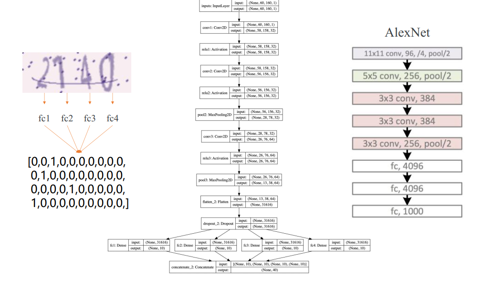

# Verification code recognition model

## 开发环境
- pip install Pillow captcha pydot flaskpip 
- Pillow (PIL Fork)
    - PIL(Python Imaging Library) 为 Python 解释器添加了图像处理功能
    - Pillow 是由 Alex Clark 及社区贡献者 一起开发和维护的一款分叉自 PIL 的图像工具库。
- captcha
    - Captcha 是一个生成图像和音频验证码的开源工具库。
- pydot
    - pydot 是用纯 Python 实现的 GraphViz 接口， 支持使用 GraphViz 解析和存储 DOT语言（graph description language） 
- flask
    - flask 是一个基于 Werkzeug 和 jinja2 开发的 Python Web 应用程序框架

## 生成验证码数据集
- 验证码（CAPTCHA） 简介
    - 全自动区分计算机和人类的公开图灵测试（英语： Completely Automated Public Turing testto tell Computers and Humans Apart， 简称CAPTCHA） ， 俗称验证码， 是一种区分用户是计算机或人的公共全自动程序。
- 验证码（CAPTCHA） 破解
- 验证码（CAPTCHA） 演进
- 验证码（CAPTCHA） 生成
    - 使用 Pillow（PIL Fork） 和 captcha 库生成验证码图像

- Code:
    - [CreateCaptchaDatasetSaveToDisk](CreateCaptchaDatasetSaveToDisk.py)
    
    - [CreateCaptchaDatasetSaveToMemory](CreateCaptchaDatasetSaveToMemory.py)

## 输入与输出数据处理
- 输入数据处理
    - 图像处理： RGB图 -> 灰度图 -> 规范化数据
    - 适配 Keras 图像数据格式： “channels_frist” 或 “channels_last”
- 输出数据处理
    - One-hot 编码： 验证码转向量
    - 解码： 模型输出向量转验证码
- Code
    - 读取数据与标签
    - 数据可视化
    - 转为灰度图
    - 数据规范化
    - 适配Keras数据格式
    - One-hot编码
    - 验证码向量解码
    - [DataProcess](./DataProcess.py)
		
		
## 模型结构设计
- 分类问题
    - 图像分类模型 AlexNet
    
    - 使用卷积进行特征提取
    - 图像分类模型 VGG-16
    
    
- 验证码识别模型结构

- 验证码识别模型实现
	
	
## 模型损失函数设计
- 交叉熵（Cross-Entropy, CE）
    - 使用交叉熵作为该模型的损失函数
- Categorical CE Loss（ Softmax Loss）
    - 常用于输出为 One-hot 向量的多类别分类（ Multi-Class Classification） 模型
- Binary CE Loss（ Sigmoid CE Loss）
    - 常被用于多标签分类（ Multi-label classification） 模型

- Code
    - 转为灰度图
    - One-hot编码
    - 验证码向量解码
    - 适配Keras数据格式
    - 读取数据与标签
    - 数据规范化
    - 创建验证码识别模型
    - 查看模型摘要
    - 模型可视化
    - 训练模型
    - 预测样例
    - 保存模型
    - 保存训练过程模型
    - [TrainModel](TrainModel.py)

## 

